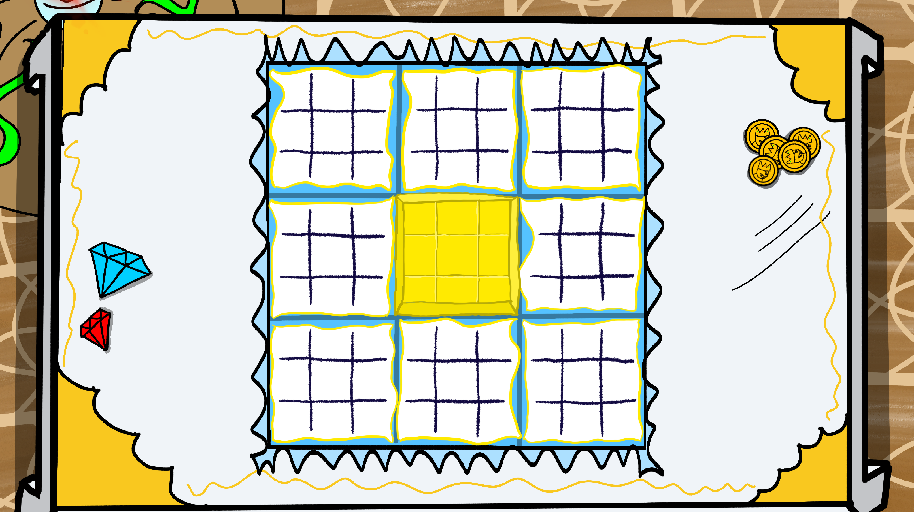

# Ultra Tic-Tac-Toe


Ultra Tic-Tac-Toe is a (kind of) fun multiplayer game, that replicates the real life Tic-Tac-Toe spin-off "Super Tic-Tac-Toe". It's like the original pen and paper game with the classic 3x3 field, but you have nine of those.

> Basically a big Tic-Tac-Toe field with a bunch of smaller Tic-Tac-Toe fields inside each cell.


## Game Rules

Ultra Tic-Tac-Toe borrows it's ruleset from 'Super Tic-Tac-Toe'. The Gamefield consists of one big Tic-Tac-Toe fields, that has nine smaller games of Tic-Tac-Toe in each of it's cells. The host starts and can place their marker wherever they want. The cell they choose to place their marker, determines, where the other player is allowed to place theirs next. If they choose to place theirs in the middle game on the **top right cell**, the other player **must** place their marker in the **top-right game**. If they now place in the middle, your the other person has to play in the middle game.

This continues until one of the players gets three in a row one of the nine games. When that happens, they mark the **entire cell** for themselves. If a player happens to place his marker, where the game is already won by someone, the other player can choose any place to put his marker, just like in the beginning.

The goal for both players is to win enough small games, to line up three games in a row.

## How to play

- Install the game [here]('itch.io') on itch.io or directly from GitHub
- Install RadminVPN or similar software and Launch
- Connect to the same network with whoever you want to play against
- If you're the host, start the game, select a name and profile picture and click on _'Host'_
- If your enemy is the host, enter their respective IP-Address from RadminVPN and click on _'Join'_

## How it works

<details>

<summary>Click to expand</summary>

The Game was made with Flutter, which may seem like a strange choice, if you compare it to libraries, that are purposefully made for Videogames, like [Lumina Engine]('google.com'). Before making this game, I was working on Shop-Up and learning Flutter whilst doing so. One day I heard about Super Tic-Tac-Toe and was instantly fascinated by it. Tic-Tac-Toe has always been a fun, but shallow game for me. Now seeing it with a new layer of depth made me pretty excited, so I tried it in an online whiteboard software and it felt pretty anticlimactic. Then and there, I decided to put Shop-Up on a halt and start this small sideproject for three reasons:

1. The one I just described
2. I never made a multiplayer game before this
3. I wanted to learn more about Flutter

In the beginning my estimate was, that this game was going to take about one weekend. This _could_ have been true, if I hadn't had a bunch of Ideas for new features. Also easy to use multiplayer, even on a level as simple as this, was **way** harder than I anticipated. I'll come to, what I mean with "easy to use" a bit later.

</details>

## How I made it

<details>

<summary>Click to expand</summary>

The basic game structure, with the big field was done in a single day. I didn't use a canvas at all, because I thought just using regular widgets would make this process more streamlined and easier, but a bit more cookie-cutter, which is a compromise I was very willing to accept for a small sideproject like this.


### Day 1

I used a Gridview with 3 columns and 3 rows, that holds a "SmallTTTField" Widget in each of it's cells. This is the widget for each small Game. A small Field also has a Gridview with 9 Buttons instead of Fields. Each single Field knows it's position on the big grid and each small button knows it's position in it's small Game. So when you press one of those buttons, it calls a function from the small field with it's own local position, which then calls a function on the big field, with it's global position. 

``` dart

// SmallTTTFieldButton.dart 

void checkEnemyMark() {
  setState(() {
    selected = true;
    selectedBy = 2;
  });
}

void checkMark() {
  if(selected) return;

  setState(() {
    selected = true;
    selectedBy = 1;
    widget.checkWinner();
    widget.checkPosition(widget.localPosition);
  });
}

```

``` dart

// SmallTTTField.dart

buttons = [
    for(int i = 0; i < 9; i++)
        SmallTTTFieldButton(
            key: buttonKeys[i],

            selectedAsset: widget.checkedAsset,
            enemySelectedAsset: widget.enemyCheckedAsset,

            localPosition: i,
            checkPosition: (pos) {
                widget.checkField(widget.localPosition, pos);
            },

            checkWinner: () {
                checkWinner(); 
                widget.checkGlobalWinner();
            },

            hoveredColor: widget.hoveredColor,
        )
];

```


``` dart

// GameScreen.dart

void checkField(int globalPosition, int localPosition) {
  if(!mounted) return;
  setState(() {
    yourTurn = false;

    setPhase(1);

    movePlayed = true;

    if(fieldKeys[localPosition].currentState!.checked) {
      currentField = 9;
    } else {
      currentField = localPosition;
    }

    client.SocketClient.makeMove(globalPosition, localPosition);
  });


  print('checked position g: $globalPosition l: $localPosition');
}

```

The big field functions as the "Game Manager" here. It would've been a better approach, if instead I had made a dedicated GameManager class, but I didn't. The GameManager then sets the next active Field to be **the same** number, as the **local field** provided by the function call.

The "currentField" boolean describes, which Field is currently active. The rules say, that the position of the mark on a game translates to the field you're allowed to play in next. If currentfield is between 0-8, then only the respective field is active. If it's 9, then the player is allowed to play anywhere.

``` dart
child: SmallTTTField(
  key: fieldKeys[i],
  checkField: checkField,
  checkGlobalWinner: checkWinner,

  localPosition: i,
  currentlySelected: currentField == 9 || currentField == i, // check if field is either the same as it's number, or 9 (every field can play)

  checkedAsset: 'assets/animations/${widget.map}X',
  enemyCheckedAsset: 'assets/animations/${widget.map}O',

  winningMoves: winningMoves,

  map: widget.map,

  hoveredColor: bpmMap[widget.map]![2],
)
```

### Day 2

The next day, I started working on multiplayer. Like I said before, I used SocketIO, which is a JavaScript library, that establishes websockets, which allow you to create real-time bidirectional communication between a server and a client.


What basically needed to happen was, when you mark a field, a packet, containing the information for where you placed it had to be sent to the server, which then sends it to the other player. The other player then could see that you placed something, and place something in return. Due to the simplicity of information for Super TicTacToe, the server-side code ended up being very short and easy to understand. I did not need to use any client-side prediction, packets every second or anything like that.

``` dart

// Server.dart

class _Player {
  final String username;
  final int picture;
  final Socket socket;
  final bool isHost;

  const _Player({required this.username, required this.picture, required this.socket, required this.isHost});
}

class GameServer {
  static Server io = Server();

  static stopServer() {
    io.close();
    io = Server();

    _players = List.empty(growable: true);
  }

  static List<_Player> _players = List.empty(growable: true);
  static String currentMap = '';

  static bool startServer() {
    try{
      io.on('connection', (socket) {
        print('player connected');

        socket.on('startgame', (data) {
          if(socket == _players[0].socket) {io.emit('hoststartgame', data);}
        });

        socket.on('playermove', (res) {
          io.emit('playermove', res);
        });

        socket.on('changeMap', (data) {
          currentMap = data;

          socket.broadcast.emit('hostchangedmap', data);
        });

        socket.on('playerInformation', (data) {

          bool isHost = _players.isEmpty;

          _players.add(_Player(
            username: data['username'],
            picture: data['picture'],
            socket: socket,
            isHost: isHost,
          ));

          print('sending gameinfo');

          socket.emit('gameinformation', {
              'you': {
                'username': data['username'],
                'picture': data['picture'],
                'isHost': isHost
              },
              'enemy': isHost ? null : {
                'username': _players[0].username,
                'picture': _players[0].picture,
                'isHost': true
              },
              'map': currentMap,
            }
          );

          socket.broadcast.emit('userjoinedlobby', {
            'username': data['username'],
            'picture': data['picture'],
            'isHost': isHost,
          });
        });

        socket.on('disconnect', (data) {
          _players.removeWhere((player) => player.socket == socket);
          socket.broadcast.emit('playerleave', [
            for(_Player player in _players)
              {'username': player.username, 'isHost': player.isHost}
          ]);
        });
      });

      io.on('connect_error', (e) {
        print(e);
      });

      io.listen(8000);

      return true;
    } catch(e) {
      stopServer();
      return false;
    }
  }
}
```

The multiplayer part was done with that very quickly. After that I had to work on winning and loosing. What happens is, after every move, the field compares its lineup of markers, with each winning move. Once for you, and once for the enemy. If one of you has a winning position (three in a row), you mark the entire field for you. After that, the entire Game Field checks if the fields represent a winning position for either one of you, if yes, then that player wins.

``` dart
// SmallTTTField.dart

void checkWinner() {
    final List<int> currentLayout = List.empty(growable: true);
    for(int i = 0; i < 9; i++) {
      currentLayout.add(buttonKeys[i].currentState!.selectedBy);
    }

    bool checkAllFields() {
      for(int j = 0; j < 9; j++) {
        if(currentLayout[j] == 0) return false;
      }
      return true;
    }

    if(checkAllFields()) {
      setState(() {
        checked = true;
        checkedBy = 3;
      });
      return;
    }

    bool _checkSingleMove(List<int> move, int checkEnemy) {
      int counter = 0;
      for(int j = 0; j < 9; j++) {
        if(currentLayout[j] == 1 + checkEnemy && move[j] == 1) counter++;
      }
      return counter == 3;
    }

    for(List<int> winningMove in widget.winningMoves) {
      if(_checkSingleMove(winningMove, 0)) {
        setState(() {
          checked = true;
          checkedBy = 1;
        });
      }

      if(_checkSingleMove(winningMove, 1)) {
        setState(() {
          checked = true;
          checkedBy = 2;
        });
      }
    }
  }


```

After I was done, I made a short youtube video, showing my progress until now.

<!-- [](https://www.youtube.com/watch?v=JgWpx-lsXUg "Ultra TicTacToe multiplayer test") -->

*ultra tictactoe multiplayer test*
<iframe width="560" height="315" src="https://www.youtube.com/embed/JgWpx-lsXUg?si=V7vGWp7nFc7skJWC" title="YouTube video player" frameborder="0" allow="accelerometer; autoplay; clipboard-write; encrypted-media; gyroscope; picture-in-picture; web-share" allowfullscreen></iframe>

### Day 3 and onwards

After those two days, all I had to do was cleaning up, a good menu screen easy multiplayer hosting, maps and so on. I drew the maps myself, with one of them even having a continuosly moving map, as if you were "walking"

*Palace.png*


*Night.png*


*Classroom.png*


</details>